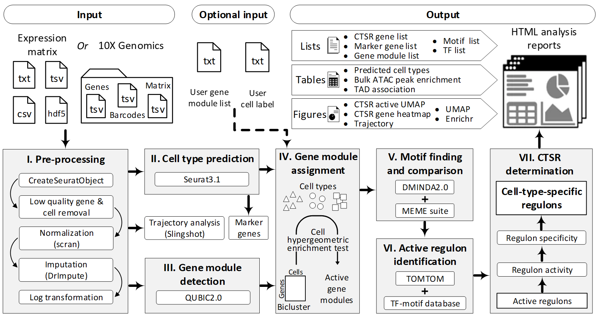

# CeRIS

CeRIS (Cell-type-specific Regulon Inference from Single-cell RNA-Seq) is an integrated web server for cell-type-specific regulon (CTSR) prediction from Human or Mouse Single-cell RNA-Seq data.

1. It is an all-in-one pipeline for CTSR identification, organically integrating biclustering for cell-type-specific gene module detection and de novo motif prediction in support of potential novel regulons discovery; 
2. It provides informative CTSR interpretations in support of in-depth analysis of heterogeneous regulatory mechanisms;

3. It is equipped with a user-friendly web interface that requires no programming knowledge, with a simple submission process, comprehensive scRNA-Seq data analysis functionalities, and highly-interactive visualizations. 

The CeRIS web server is freely accessible from https://bmbl.bmi.osumc.edu/CeRIS/ with no login requirement. 

## Overview of CeRIS pipeline

## How to submit job
https://bmbl.bmi.osumc.edu/CeRIS/tutorial.php#2submission 
## Example results illustration
https://bmbl.bmi.osumc.edu/CeRIS/tutorial.php#3example
## FAQ
https://bmbl.bmi.osumc.edu/CeRIS/more.php#4FAQ 
